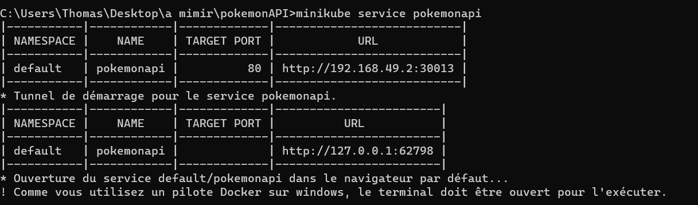

Google Cloud - Kubernetes 

<a href="https://cloud.google.com/learn/what-is-kubernetes?hl=fr "> https://cloud.google.com/learn/what-is-kubernetes?hl=fr </a>

How To Use a Dockerfile to Launch a Kubernetes Pod with a Custom NGINX Page

<a href="https://www.youtube.com/watch?v=SpLOFr53csI"> https://www.youtube.com/watch?v=SpLOFr53csI </a>

How to install Kubectl and Minikube

<a href="">https://www.youtube.com/watch?v=5-LHcpkRA58 </a>

**Mise en place d'un conteneur avec un Dockerfile**

`docker build -t thoomaas123/pokemonapi:1.0`

`docker push thoomaas123/pokemonapi:1.0`

**Installation de minikube**

`minikube start`

**Mise en place de kubernetes**

`kubectl create deployment pokemonapi --image=docker.io/thoomaas123/pokemonapi:1.0`

`kubectl expose deployment pokemonapi --type=NodePort --port=80 --name=pokemonapi`

`kubectl get pods`

`minikube service pokemonapi`

</img>
